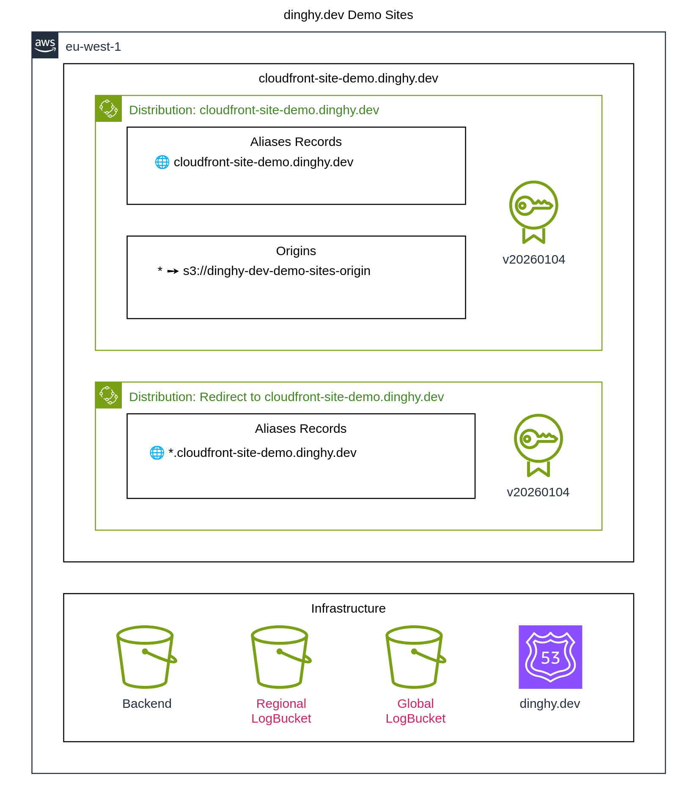

# A Dinghy powered Cloudfront Demo Site

This is a complete, end-to-end Infrastructure as Code (IaC) example project
using Dinghy, showcasing the
[CloudFront Sites](https://dinghy.dev/show-cases/cloudfront-sites).

## Generate Deployment Diagram

## Local Development

### Install Dinghy Cli

Need only once if not already done:

    curl -fsSL https://get.dinghy.dev/install.sh | sh

### To develop with devcontainer

    dinghy devcontainer

### To render all output fomrats

    dinghy render

### Performing tf diff

    dinghy tf diff

This command performs the following steps:

1. Renders all files in Terraform format (`render --format tf`)
2. Initializes Terraform (`tf init`)
3. Plans the changes with Terraform (`tf plan`)
4. Triggers additional CI/CD notifications and allows for manual job approval

### Performing tf deploy

    dinghy tf deploy

This command executes the following steps:

1. Initializes Terraform (`tf init`)
2. Applies the changes using Terraform (`tf apply`)
3. Triggers additional CI/CD notifications

## Dinghy documentation

For detailed documentation and usage examples, visit: https://dinghy.dev
